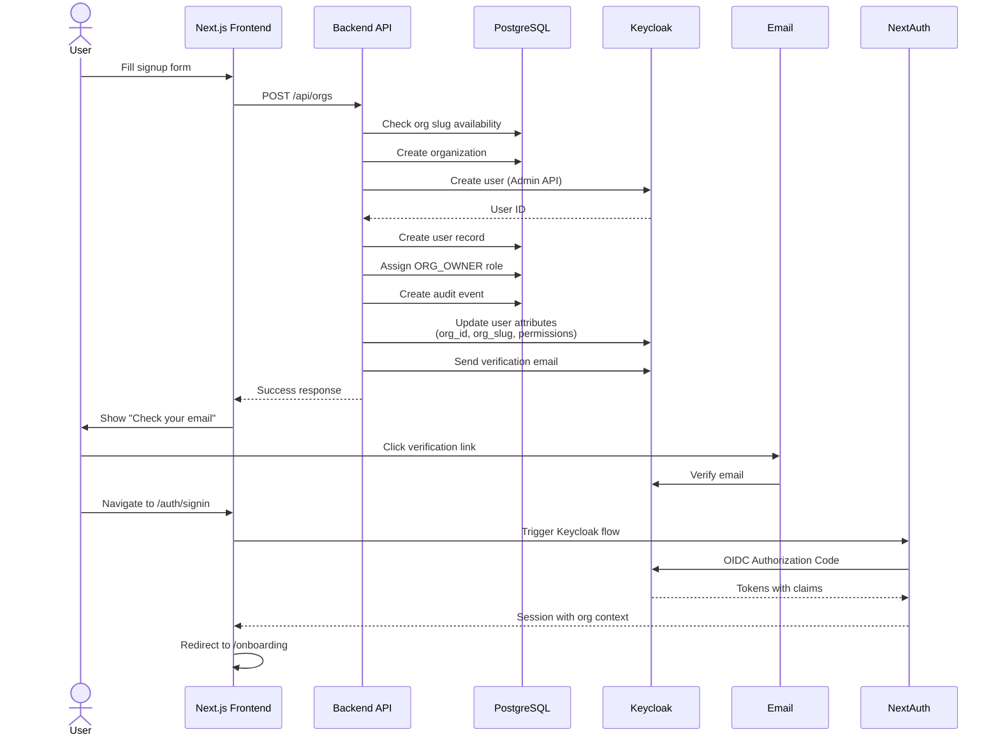
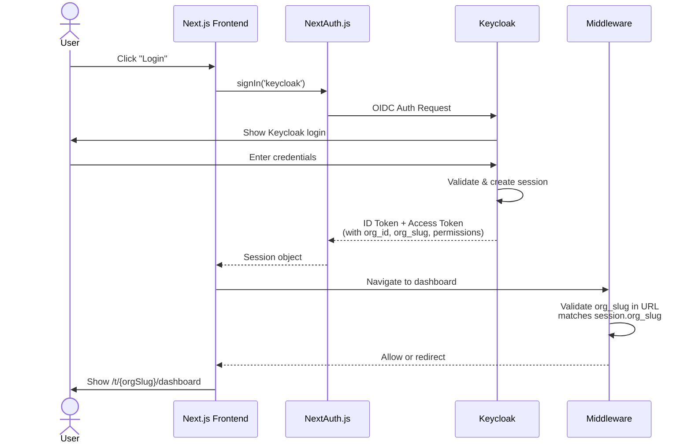
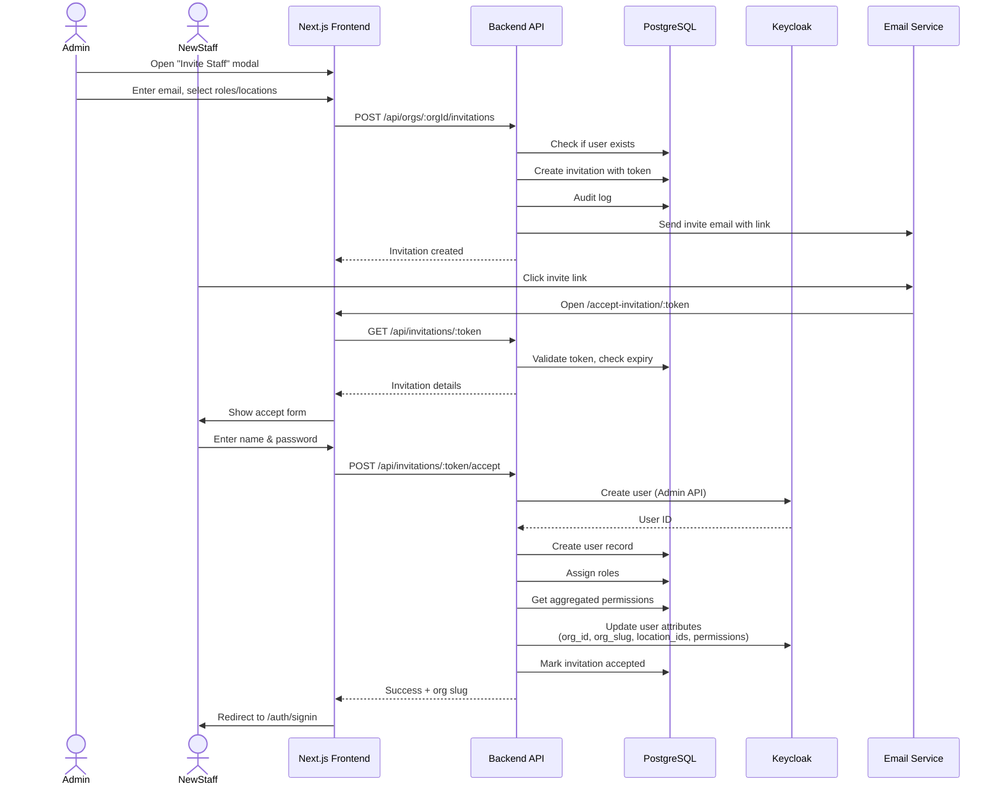
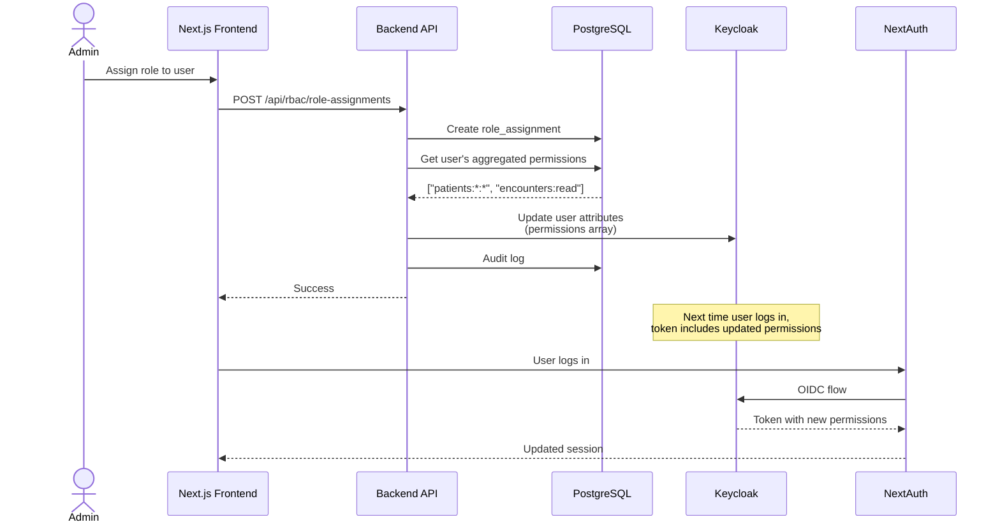

# Complete Integration Architecture Guide

## Overview

This document provides a complete end-to-end guide for integrating all components of the multi-tenant healthcare platform, ensuring frontend NEVER calls Keycloak directly.

---

## Architecture Principles

### ✅ DO
- Frontend calls backend APIs only
- Backend handles ALL Keycloak operations
- Use NextAuth.js for authentication flow
- Middleware validates org context
- All user attributes synced through backend

### ❌ DON'T  
- Frontend calling Keycloak Admin API directly
- Frontend calling Keycloak user provisioning
- Bypassing backend for auth operations
- Hardcoded roles or permissions

---

## Complete Flow Diagrams

### 1. Signup & Organization Creation Flow



### 2. Login Flow (Existing Users)



### 3. Staff Invitation Flow



### 4. Role Assignment & Permission Sync



---

## Implementation Details

### Frontend: Signup Page

**File**: `ehr-web/src/app/register/page.tsx`

```typescript
'use client';

import { useState } from 'react';
import { useRouter } from 'next/navigation';

export default function RegisterPage() {
  const router = useRouter();
  const [formData, setFormData] = useState({
    org_name: '',
    owner_email: '',
    owner_name: '',
    owner_password: '',
    legal_name: '',
    contact_phone: '',
    terms_accepted: false,
    baa_accepted: false,
  });
  const [error, setError] = useState('');
  const [loading, setLoading] = useState(false);

  const handleSubmit = async (e: React.FormEvent) => {
    e.preventDefault();
    setLoading(true);
    setError('');

    try {
      const response = await fetch('/api/orgs', {
        method: 'POST',
        headers: { 'Content-Type': 'application/json' },
        body: JSON.stringify(formData),
      });

      if (!response.ok) {
        const data = await response.json();
        throw new Error(data.error || 'Registration failed');
      }

      const result = await response.json();
      
      // Show success message
      alert(result.message);
      
      // Redirect to login
      router.push('/auth/signin');
    } catch (err: any) {
      setError(err.message);
    } finally {
      setLoading(false);
    }
  };

  return (
    <div className="min-h-screen flex items-center justify-center">
      <div className="max-w-md w-full space-y-8 p-8 bg-white rounded-lg shadow">
        <h2 className="text-3xl font-bold text-center">Register Your Organization</h2>
        
        {error && (
          <div className="bg-red-50 border border-red-200 text-red-700 px-4 py-3 rounded">
            {error}
          </div>
        )}

        <form onSubmit={handleSubmit} className="space-y-4">
          <div>
            <label className="block text-sm font-medium mb-1">
              Organization Name *
            </label>
            <input
              type="text"
              required
              className="w-full px-3 py-2 border rounded-md"
              value={formData.org_name}
              onChange={(e) => setFormData({ ...formData, org_name: e.target.value })}
            />
          </div>

          <div>
            <label className="block text-sm font-medium mb-1">
              Your Name *
            </label>
            <input
              type="text"
              required
              className="w-full px-3 py-2 border rounded-md"
              value={formData.owner_name}
              onChange={(e) => setFormData({ ...formData, owner_name: e.target.value })}
            />
          </div>

          <div>
            <label className="block text-sm font-medium mb-1">
              Email *
            </label>
            <input
              type="email"
              required
              className="w-full px-3 py-2 border rounded-md"
              value={formData.owner_email}
              onChange={(e) => setFormData({ ...formData, owner_email: e.target.value })}
            />
          </div>

          <div>
            <label className="block text-sm font-medium mb-1">
              Password *
            </label>
            <input
              type="password"
              required
              minLength={8}
              className="w-full px-3 py-2 border rounded-md"
              value={formData.owner_password}
              onChange={(e) => setFormData({ ...formData, owner_password: e.target.value })}
            />
          </div>

          <div>
            <label className="block text-sm font-medium mb-1">
              Legal Name
            </label>
            <input
              type="text"
              className="w-full px-3 py-2 border rounded-md"
              value={formData.legal_name}
              onChange={(e) => setFormData({ ...formData, legal_name: e.target.value })}
            />
          </div>

          <div>
            <label className="block text-sm font-medium mb-1">
              Contact Phone
            </label>
            <input
              type="tel"
              className="w-full px-3 py-2 border rounded-md"
              value={formData.contact_phone}
              onChange={(e) => setFormData({ ...formData, contact_phone: e.target.value })}
            />
          </div>

          <div className="space-y-2">
            <label className="flex items-center">
              <input
                type="checkbox"
                required
                checked={formData.terms_accepted}
                onChange={(e) => setFormData({ ...formData, terms_accepted: e.target.checked })}
                className="mr-2"
              />
              <span className="text-sm">I accept the Terms & Conditions *</span>
            </label>

            <label className="flex items-center">
              <input
                type="checkbox"
                required
                checked={formData.baa_accepted}
                onChange={(e) => setFormData({ ...formData, baa_accepted: e.target.checked })}
                className="mr-2"
              />
              <span className="text-sm">I accept the Business Associate Agreement *</span>
            </label>
          </div>

          <button
            type="submit"
            disabled={loading}
            className="w-full bg-blue-600 text-white py-2 px-4 rounded-md hover:bg-blue-700 disabled:opacity-50"
          >
            {loading ? 'Creating Organization...' : 'Register'}
          </button>
        </form>

        <p className="text-center text-sm">
          Already have an account?{' '}
          <a href="/auth/signin" className="text-blue-600 hover:underline">
            Sign in
          </a>
        </p>
      </div>
    </div>
  );
}
```

### Frontend: Accept Invitation Page

**File**: `ehr-web/src/app/accept-invitation/[token]/page.tsx`

```typescript
'use client';

import { useState, useEffect } from 'react';
import { useRouter } from 'next/navigation';

export default function AcceptInvitationPage({ params }: { params: { token: string } }) {
  const router = useRouter();
  const [invitation, setInvitation] = useState<any>(null);
  const [loading, setLoading] = useState(true);
  const [error, setError] = useState('');
  const [formData, setFormData] = useState({
    name: '',
    password: '',
  });

  useEffect(() => {
    loadInvitation();
  }, []);

  const loadInvitation = async () => {
    try {
      const response = await fetch(`/api/invitations/${params.token}`);
      
      if (!response.ok) {
        const data = await response.json();
        throw new Error(data.error);
      }

      const data = await response.json();
      setInvitation(data.invitation);
    } catch (err: any) {
      setError(err.message);
    } finally {
      setLoading(false);
    }
  };

  const handleAccept = async (e: React.FormEvent) => {
    e.preventDefault();
    setLoading(true);
    setError('');

    try {
      const response = await fetch(`/api/invitations/${params.token}/accept`, {
        method: 'POST',
        headers: { 'Content-Type': 'application/json' },
        body: JSON.stringify(formData),
      });

      if (!response.ok) {
        const data = await response.json();
        throw new Error(data.error);
      }

      const result = await response.json();
      
      // Show success and redirect to login
      alert(result.message);
      router.push('/auth/signin');
    } catch (err: any) {
      setError(err.message);
    } finally {
      setLoading(false);
    }
  };

  if (loading && !invitation) {
    return <div className="flex items-center justify-center min-h-screen">Loading...</div>;
  }

  if (error && !invitation) {
    return (
      <div className="flex items-center justify-center min-h-screen">
        <div className="bg-red-50 border border-red-200 text-red-700 px-6 py-4 rounded">
          {error}
        </div>
      </div>
    );
  }

  return (
    <div className="min-h-screen flex items-center justify-center">
      <div className="max-w-md w-full space-y-8 p-8 bg-white rounded-lg shadow">
        <div>
          <h2 className="text-3xl font-bold text-center">Accept Invitation</h2>
          <p className="mt-2 text-center text-gray-600">
            You've been invited to join <strong>{invitation.org_name}</strong>
          </p>
          <p className="mt-1 text-center text-sm text-gray-500">
            by {invitation.invited_by_name}
          </p>
        </div>

        {error && (
          <div className="bg-red-50 border border-red-200 text-red-700 px-4 py-3 rounded">
            {error}
          </div>
        )}

        <div className="bg-blue-50 border border-blue-200 p-4 rounded">
          <p className="text-sm"><strong>Email:</strong> {invitation.email}</p>
          <p className="text-sm"><strong>Roles:</strong> {invitation.role_keys.join(', ')}</p>
        </div>

        <form onSubmit={handleAccept} className="space-y-4">
          <div>
            <label className="block text-sm font-medium mb-1">
              Your Full Name *
            </label>
            <input
              type="text"
              required
              className="w-full px-3 py-2 border rounded-md"
              value={formData.name}
              onChange={(e) => setFormData({ ...formData, name: e.target.value })}
            />
          </div>

          <div>
            <label className="block text-sm font-medium mb-1">
              Create Password *
            </label>
            <input
              type="password"
              required
              minLength={8}
              className="w-full px-3 py-2 border rounded-md"
              value={formData.password}
              onChange={(e) => setFormData({ ...formData, password: e.target.value })}
            />
            <p className="text-xs text-gray-500 mt-1">
              Minimum 8 characters
            </p>
          </div>

          <button
            type="submit"
            disabled={loading}
            className="w-full bg-blue-600 text-white py-2 px-4 rounded-md hover:bg-blue-700 disabled:opacity-50"
          >
            {loading ? 'Creating Account...' : 'Accept & Create Account'}
          </button>
        </form>
      </div>
    </div>
  );
}
```

---

## API Proxy Pattern

All Keycloak operations go through backend. Frontend NEVER calls Keycloak directly.

### Example: User Deactivation

**Frontend**:
```typescript
// ❌ DON'T DO THIS
await keycloakAdminClient.users.update({ id, enabled: false });

// ✅ DO THIS
await fetch(`/api/orgs/${orgId}/users/${userId}/status`, {
  method: 'PATCH',
  body: JSON.stringify({ status: 'disabled', reason: 'Terminated' })
});
```

**Backend handles Keycloak**:
```javascript
router.patch('/:orgId/users/:userId/status', async (req, res) => {
  const { status, reason } = req.body;
  
  // Update database
  await query('UPDATE users SET status = $1 WHERE id = $2', [status, userId]);
  
  // Sync to Keycloak
  if (status === 'disabled') {
    await KeycloakService.disableUser(user.keycloak_user_id);
    await KeycloakService.logoutUser(user.keycloak_user_id);
  }
  
  // Audit log
  await auditLog(...)
  
  res.json({ success: true });
});
```

---

## Environment Variables

### Backend (.env)
```env
# Database
DB_HOST=localhost
DB_PORT=5432
DB_NAME=medplum
DB_USER=medplum
DB_PASSWORD=your_password

# Keycloak Admin
KEYCLOAK_URL=http://localhost:8080
KEYCLOAK_REALM=ehrconnect
KEYCLOAK_ADMIN_USER=admin
KEYCLOAK_ADMIN_PASSWORD=admin_password
KEYCLOAK_CLIENT_ID=admin-cli
KEYCLOAK_CLIENT_SECRET=your_client_secret
```

### Frontend (.env.local)
```env
# NextAuth
NEXTAUTH_URL=http://localhost:3000
NEXTAUTH_SECRET=generate_with_openssl_rand_base64_32

# Keycloak (for NextAuth provider only)
NEXT_PUBLIC_KEYCLOAK_URL=http://localhost:8080
NEXT_PUBLIC_KEYCLOAK_REALM=ehrconnect
NEXT_PUBLIC_KEYCLOAK_CLIENT_ID=nx-web
KEYCLOAK_CLIENT_SECRET=your_client_secret

# API
NEXT_PUBLIC_API_URL=http://localhost:3001
```

---

## Deployment Checklist

- [ ] Database schema applied
- [ ] Keycloak client scopes configured
- [ ] Environment variables set
- [ ] API routes registered in index.js
- [ ] Frontend signup/login pages created
- [ ] Middleware configured
- [ ] Test complete signup flow
- [ ] Test invitation flow
- [ ] Test role assignment syncs to Keycloak
- [ ] Test permission-based UI rendering
- [ ] Test org isolation
- [ ] Test session revocation on disable

---

## Summary

**Key Integration Points:**

1. **Signup**: Frontend → Backend API → Keycloak (Admin) → Database
2. **Login**: Frontend → NextAuth → Keycloak (OIDC) → Session with claims
3. **Invitation**: Admin creates → Backend → Database → Email → New user accepts → Backend provisions in Keycloak
4. **Role Management**: Admin assigns role → Backend → Database → Sync permissions to Keycloak attributes
5. **Permission Check**: Frontend reads session.permissions (from Keycloak claims synced by backend)

**All Keycloak operations flow through backend APIs - frontend never touches Keycloak Admin API.**

This architecture ensures:
- ✅ Centralized control
- ✅ Proper audit logging
- ✅ Security compliance
- ✅ Easier testing and debugging
- ✅ No exposed admin credentials
