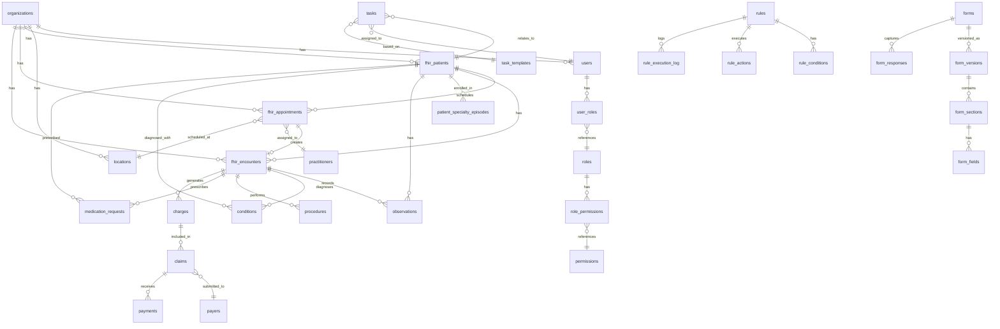

# EHRConnect Database ER Diagram & Field Mapping
**Date**: December 17, 2025
**Version**: 1.0.0
**Purpose**: Comprehensive database structure documentation with UI-to-database field mapping

## Executive Summary

This document provides a complete Entity-Relationship (ER) diagram and field mapping for the EHRConnect system. It maps every UI data point to its corresponding database table and field, addressing the issue of APIs currently "jumping to one file server" instead of using proper database structures.

## Table of Contents
1. [Core Entity Overview](#core-entity-overview)
2. [Detailed ER Diagram](#detailed-er-diagram)
3. [Table Schemas](#table-schemas)
4. [UI-to-Database Field Mapping](#ui-to-database-field-mapping)
5. [Missing Tables Analysis](#missing-tables-analysis)
6. [Recommended Improvements](#recommended-improvements)

---

## Core Entity Overview

### Primary Entities (14 Core Domains)

```
┌─────────────────────────────────────────────────────────────────┐
│                     EHRConnect Database Architecture             │
└─────────────────────────────────────────────────────────────────┘

1. ORGANIZATION & ACCESS MANAGEMENT
   ├── organizations (multi-tenant root)
   ├── users (system users)
   ├── user_roles (RBAC assignments)
   ├── roles (role definitions)
   ├── permissions (granular permissions)
   ├── locations (physical facilities)
   └── departments (organizational units)

2. PATIENT MANAGEMENT
   ├── fhir_patients ⭐ (patient demographics - FHIR R4)
   ├── patient_specialty_episodes (episode tracking)
   ├── patient_portal_users (portal access)
   └── patient_portal_registrations (portal signups)

3. CLINICAL STAFF
   ├── practitioners (providers/clinicians)
   ├── practitioner_qualifications (credentials)
   └── provider_schedules (availability)

4. SCHEDULING & APPOINTMENTS
   ├── fhir_appointments ⭐ (appointments - FHIR R4)
   ├── appointment_slots (available slots)
   ├── specialty_visit_types (visit type definitions)
   └── virtual_meetings (telehealth sessions)

5. CLINICAL ENCOUNTERS
   ├── fhir_encounters ⭐ (visit documentation - FHIR R4)
   ├── observations (vitals, labs, measurements)
   ├── conditions (diagnoses)
   ├── procedures (performed procedures)
   ├── medication_requests (prescriptions)
   └── clinical_notes (SOAP notes, documentation)

6. BILLING & REVENUE CYCLE
   ├── billing_codes (ICD-10, CPT, HCPCS)
   ├── billing_modifiers (claim modifiers)
   ├── payers (insurance companies)
   ├── charges (encounter charges)
   ├── claims (insurance claims)
   ├── payments (payment tracking)
   └── prior_authorizations (PA management)

7. FORMS & QUESTIONNAIRES
   ├── forms (form definitions)
   ├── form_versions (version control)
   ├── form_sections (form structure)
   ├── form_fields (field definitions)
   ├── form_responses (captured data)
   └── questionnaire_responses (FHIR responses)

8. RULE ENGINE & AUTOMATION
   ├── rules (rule definitions)
   ├── rule_conditions (logic)
   ├── rule_actions (automated actions)
   ├── rule_execution_log (execution history)
   └── rule_variables (dynamic variables)

9. TASK MANAGEMENT
   ├── tasks (task definitions)
   ├── task_templates (reusable tasks)
   ├── task_assignments (user assignments)
   └── task_assignment_rules (auto-assignment)

10. INVENTORY MANAGEMENT
    ├── inventory_items (products/supplies)
    ├── inventory_categories (categorization)
    ├── inventory_suppliers (vendors)
    ├── inventory_locations (storage locations)
    ├── inventory_transactions (stock movements)
    └── purchase_orders (procurement)

11. SPECIALTY SYSTEM
    ├── specialty_packs (available specialties)
    ├── org_specialty_settings (enabled specialties)
    ├── specialty_pack_audits (configuration history)
    └── patient_specialty_episodes (episode management)

12. COUNTRY COMPLIANCE
    ├── country_packs (country configurations)
    ├── org_country_settings (enabled countries)
    ├── country_modules (country-specific modules)
    ├── org_enabled_modules (active modules)
    └── country_pack_audits (compliance tracking)

13. INTEGRATIONS
    ├── integrations (integration configs)
    ├── integration_vendors (vendor catalog)
    ├── data_mappers (field mappings)
    ├── hl7_messages (HL7 v2 messages)
    └── webhook_logs (webhook history)

14. AUDIT & SECURITY
    ├── audit_logs (comprehensive audit trail)
    ├── fhir_audit_events (FHIR AuditEvents)
    ├── user_sessions (active sessions)
    ├── mfa_devices (2FA devices)
    └── notification_settings (user preferences)
```

---

## Detailed ER Diagram

### Core Relationships



---

## Table Schemas

### 1. FHIR Patients Table (PRIMARY PATIENT ENTITY)

**Table**: `fhir_patients`
**Purpose**: Store patient demographics and identifiers (FHIR R4 compliant)
**Multi-tenant**: Yes (org_id)

```sql
CREATE TABLE fhir_patients (
  -- Primary Key & Organization
  id UUID PRIMARY KEY DEFAULT gen_random_uuid(),
  org_id UUID NOT NULL REFERENCES organizations(id) ON DELETE CASCADE,
  
  -- FHIR Resource (full resource stored as JSONB)
  resource JSONB NOT NULL,
  
  -- Extracted Demographics (for querying)
  active BOOLEAN DEFAULT TRUE,
  family_name VARCHAR(255),
  given_name VARCHAR(255),
  full_name TEXT,  -- Auto-generated from given_name + family_name
  gender VARCHAR(20) CHECK (gender IN ('male', 'female', 'other', 'unknown')),
  birth_date DATE,
  deceased BOOLEAN DEFAULT FALSE,
  deceased_date_time TIMESTAMPTZ,
  
  -- Contact Information
  phone VARCHAR(50),
  email VARCHAR(255),
  
  -- Address Fields
  address_line TEXT,
  address_city VARCHAR(100),
  address_state VARCHAR(100),
  address_postal_code VARCHAR(20),
  address_country VARCHAR(100),
  
  -- Identifiers
  mrn VARCHAR(100),  -- Medical Record Number
  ssn VARCHAR(20),   -- Social Security Number
  national_id VARCHAR(50),  -- Aadhaar, etc.
  
  -- Communication
  preferred_language VARCHAR(10),
  
  -- Care Management
  general_practitioner_id UUID,
  managing_organization_id UUID REFERENCES organizations(id),
  
  -- Metadata
  created_at TIMESTAMPTZ DEFAULT CURRENT_TIMESTAMP,
  updated_at TIMESTAMPTZ DEFAULT CURRENT_TIMESTAMP
);

-- Indexes
CREATE INDEX idx_fhir_patients_org ON fhir_patients(org_id);
CREATE INDEX idx_fhir_patients_full_name ON fhir_patients USING gin(to_tsvector('english', full_name));
CREATE INDEX idx_fhir_patients_mrn ON fhir_patients(org_id, mrn);
CREATE INDEX idx_fhir_patients_resource_gin ON fhir_patients USING gin(resource);
```

### 2. FHIR Appointments Table

**Table**: `fhir_appointments`
**Purpose**: Manage appointment scheduling (FHIR R4 compliant)
**Multi-tenant**: Yes (org_id)

```sql
CREATE TABLE fhir_appointments (
  -- Primary Key & Organization
  id UUID PRIMARY KEY DEFAULT gen_random_uuid(),
  org_id UUID NOT NULL REFERENCES organizations(id) ON DELETE CASCADE,
  
  -- FHIR Resource
  resource JSONB NOT NULL,
  
  -- Extracted Fields
  status VARCHAR(50) NOT NULL CHECK (status IN (
    'proposed', 'pending', 'booked', 'arrived', 'fulfilled',
    'cancelled', 'noshow', 'entered-in-error', 'checked-in', 'waitlist'
  )),
  
  -- Timing
  start_time TIMESTAMPTZ NOT NULL,
  end_time TIMESTAMPTZ NOT NULL,
  duration_minutes INTEGER,
  
  -- Classification
  appointment_type VARCHAR(255),
  service_category VARCHAR(255),
  service_type VARCHAR(255),
  specialty VARCHAR(255),
  priority INTEGER DEFAULT 0,
  
  -- References
  patient_id UUID REFERENCES fhir_patients(id) ON DELETE CASCADE,
  practitioner_id UUID,  -- Reference to users table (provider)
  location_id UUID REFERENCES locations(id) ON DELETE SET NULL,
  slot_id UUID,
  
  -- Details
  description TEXT,
  patient_instruction TEXT,
  cancellation_reason TEXT,
  cancelled_at TIMESTAMPTZ,
  checked_in_at TIMESTAMPTZ,
  arrived_at TIMESTAMPTZ,
  
  -- Communication
  communication_method VARCHAR(50),  -- phone, video, in-person
  reminder_sent BOOLEAN DEFAULT FALSE,
  reminder_sent_at TIMESTAMPTZ,
  
  -- Metadata
  created_at TIMESTAMPTZ DEFAULT CURRENT_TIMESTAMP,
  updated_at TIMESTAMPTZ DEFAULT CURRENT_TIMESTAMP,
  created_by UUID REFERENCES users(id),
  updated_by UUID REFERENCES users(id),
  
  CONSTRAINT valid_times CHECK (end_time > start_time)
);

-- Indexes
CREATE INDEX idx_fhir_appointments_org ON fhir_appointments(org_id);
CREATE INDEX idx_fhir_appointments_patient ON fhir_appointments(patient_id);
CREATE INDEX idx_fhir_appointments_practitioner ON fhir_appointments(practitioner_id);
CREATE INDEX idx_fhir_appointments_start_time ON fhir_appointments(start_time);
CREATE INDEX idx_fhir_appointments_status ON fhir_appointments(status);
```

### 3. FHIR Encounters Table

**Table**: `fhir_encounters`
**Purpose**: Track patient-practitioner clinical interactions (FHIR R4 compliant)
**Multi-tenant**: Yes (org_id)

```sql
CREATE TABLE fhir_encounters (
  -- Primary Key & Organization
  id UUID PRIMARY KEY DEFAULT gen_random_uuid(),
  org_id UUID NOT NULL REFERENCES organizations(id) ON DELETE CASCADE,
  
  -- FHIR Resource
  resource JSONB NOT NULL,
  
  -- Extracted Fields
  status VARCHAR(50) NOT NULL CHECK (status IN (
    'planned', 'arrived', 'triaged', 'in-progress', 'onleave',
    'finished', 'cancelled', 'entered-in-error', 'unknown'
  )),
  class VARCHAR(50),  -- inpatient, outpatient, ambulatory, emergency, virtual
  
  -- References
  patient_id UUID REFERENCES fhir_patients(id),
  practitioner_id UUID,  -- Primary practitioner
  appointment_id UUID REFERENCES fhir_appointments(id),
  
  -- Period
  period_start TIMESTAMPTZ,
  period_end TIMESTAMPTZ,
  
  -- Type
  encounter_type VARCHAR(255),
  service_type VARCHAR(255),
  
  -- Metadata
  created_at TIMESTAMPTZ DEFAULT CURRENT_TIMESTAMP,
  updated_at TIMESTAMPTZ DEFAULT CURRENT_TIMESTAMP
);

-- Indexes
CREATE INDEX idx_fhir_encounters_org ON fhir_encounters(org_id);
CREATE INDEX idx_fhir_encounters_patient ON fhir_encounters(patient_id);
CREATE INDEX idx_fhir_encounters_appointment ON fhir_encounters(appointment_id);
CREATE INDEX idx_fhir_encounters_status ON fhir_encounters(status);
```


---

## UI-to-Database Field Mapping

This section maps every field in the UI forms to their corresponding database tables and columns.

### Patient Registration Form Mapping

**UI Form**: `/patients/new` (PatientForm component)
**Total Fields**: 50+ fields across 8 sections

#### Section 1: Provider Information
| UI Field | Database Table | Column | Data Type | Required | Notes |
|----------|---------------|--------|-----------|----------|-------|
| Primary Provider | fhir_patients | general_practitioner_id | UUID | Yes | FK to users(id) |
| Provider Location | fhir_patients | managing_organization_id | UUID | Yes | FK to locations(id) |
| Registration Date | fhir_patients | created_at | TIMESTAMPTZ | Yes | Auto-generated |
| Referred By | fhir_patients | resource->referredBy | VARCHAR | No | FHIR extension |

#### Section 2: Patient Demographics
| UI Field | Database Table | Column | Data Type | Required | Notes |
|----------|---------------|--------|-----------|----------|-------|
| Prefix | fhir_patients | resource->name[0]->prefix | VARCHAR | No | Mr, Mrs, Ms, Dr |
| First Name | fhir_patients | given_name | VARCHAR(255) | Yes | Also in resource |
| Middle Name | fhir_patients | resource->name[0]->given[1] | VARCHAR | No | FHIR array |
| Last Name | fhir_patients | family_name | VARCHAR(255) | Yes | Also in resource |
| Preferred Name | fhir_patients | resource->name[1]->text | VARCHAR | No | Alternative name |
| Date of Birth | fhir_patients | birth_date | DATE | Yes | ISO 8601 format |
| Age | fhir_patients | Calculated | INTEGER | No | Computed from DOB |
| Gender | fhir_patients | gender | VARCHAR(20) | Yes | male/female/other/unknown |
| Pronouns | fhir_patients | resource->extension->pronouns | VARCHAR | No | He/Him, She/Her, They/Them |
| Marital Status | fhir_patients | resource->maritalStatus->coding[0]->code | VARCHAR | No | S/M/D/W/U |
| Occupation | fhir_patients | resource->extension->occupation | VARCHAR | No | FHIR extension |
| Employer | fhir_patients | resource->extension->employer | VARCHAR | No | FHIR extension |
| Language | fhir_patients | preferred_language | VARCHAR(10) | No | en, es, fr, hi |
| Time Zone | fhir_patients | resource->extension->timezone | VARCHAR | No | FHIR extension |
| Preferred Communication | fhir_patients | resource->extension->preferredComm | VARCHAR | No | email/sms/phone |
| Disability Status | fhir_patients | resource->extension->disability | VARCHAR | No | FHIR extension |
| Photo | fhir_patients | resource->photo[0]->data | TEXT | No | Base64 encoded |
| Hospital ID | fhir_patients | resource->identifier[type=hospitalId] | VARCHAR | No | Organization-specific |
| Health ID | fhir_patients | national_id | VARCHAR(50) | No | ABHA, etc. |
| MRN | fhir_patients | mrn | VARCHAR(100) | No | Medical Record Number |

#### Section 3: Contact Information
| UI Field | Database Table | Column | Data Type | Required | Notes |
|----------|---------------|--------|-----------|----------|-------|
| Mobile Number | fhir_patients | phone | VARCHAR(50) | Yes | Primary phone |
| Email | fhir_patients | email | VARCHAR(255) | Yes | Primary email |
| Home Number | fhir_patients | resource->telecom[system=phone,use=home] | VARCHAR | No | Secondary phone |
| Fax Number | fhir_patients | resource->telecom[system=fax] | VARCHAR | No | Fax contact |
| Address Line 1 | fhir_patients | address_line | TEXT | Yes | Primary address |
| Address Line 2 | fhir_patients | address_line | TEXT | No | Apartment, suite |
| City | fhir_patients | address_city | VARCHAR(100) | Yes | City |
| State/Province | fhir_patients | address_state | VARCHAR(100) | Yes | State |
| Country | fhir_patients | address_country | VARCHAR(100) | Yes | Country |
| Postal Code | fhir_patients | address_postal_code | VARCHAR(20) | Yes | ZIP/Postal code |
| Preferred Contact Time | fhir_patients | resource->extension->contactTime | VARCHAR | No | FHIR extension |

#### Section 4: Emergency Contact
**NEW TABLE NEEDED**: `patient_emergency_contacts`

| UI Field | Database Table | Column | Data Type | Required | Notes |
|----------|---------------|--------|-----------|----------|-------|
| Contact Name | patient_emergency_contacts | name | VARCHAR(255) | No | Emergency contact |
| Relationship | patient_emergency_contacts | relationship | VARCHAR(50) | No | Spouse, Parent, etc. |
| Phone | patient_emergency_contacts | phone | VARCHAR(50) | No | Contact number |
| Email | patient_emergency_contacts | email | VARCHAR(255) | No | Contact email |
| Address | patient_emergency_contacts | address | TEXT | No | Contact address |
| Is Primary | patient_emergency_contacts | is_primary | BOOLEAN | No | Primary contact flag |

#### Section 5: Insurance Information
**NEW TABLE NEEDED**: `patient_insurance`

| UI Field | Database Table | Column | Data Type | Required | Notes |
|----------|---------------|--------|-----------|----------|-------|
| Insurance Company | patient_insurance | payer_id | UUID | No | FK to payers(id) |
| Policy Number | patient_insurance | policy_number | VARCHAR(100) | No | Insurance policy # |
| Group Number | patient_insurance | group_number | VARCHAR(100) | No | Group # |
| Subscriber Name | patient_insurance | subscriber_name | VARCHAR(255) | No | Policy holder |
| Subscriber DOB | patient_insurance | subscriber_dob | DATE | No | Policy holder DOB |
| Relationship to Subscriber | patient_insurance | relationship | VARCHAR(50) | No | Self, Spouse, Child |
| Effective Date | patient_insurance | effective_date | DATE | No | Coverage start |
| Termination Date | patient_insurance | termination_date | DATE | No | Coverage end |
| Priority | patient_insurance | priority | INTEGER | No | Primary=1, Secondary=2 |
| Insurance Card Front | patient_insurance | card_front_url | TEXT | No | Image URL |
| Insurance Card Back | patient_insurance | card_back_url | TEXT | No | Image URL |

#### Section 6: Preferences
| UI Field | Database Table | Column | Data Type | Required | Notes |
|----------|---------------|--------|-----------|----------|-------|
| Preferred Doctor Gender | fhir_patients | resource->extension->preferredDoctorGender | VARCHAR | No | Male/Female/No preference |
| Smoking Status | fhir_patients | resource->extension->smokingStatus | VARCHAR | No | Never/Former/Current |
| Alcohol Use | fhir_patients | resource->extension->alcoholUse | VARCHAR | No | None/Occasional/Daily |
| Blood Group | fhir_patients | resource->extension->bloodGroup | VARCHAR | No | A+, B+, O-, etc. |
| Race | fhir_patients | resource->extension->race | VARCHAR | No | US Core extension |
| Ethnicity | fhir_patients | resource->extension->ethnicity | VARCHAR | No | US Core extension |

#### Section 7: Privacy & Consent
**NEW TABLE NEEDED**: `patient_consents`

| UI Field | Database Table | Column | Data Type | Required | Notes |
|----------|---------------|--------|-----------|----------|-------|
| Consent to Email | patient_consents | consent_email | BOOLEAN | Yes | Email communication |
| Consent to Call | patient_consents | consent_call | BOOLEAN | Yes | Phone calls |
| Consent to SMS | patient_consents | consent_sms | BOOLEAN | Yes | Text messages |
| Allow Data Sharing | patient_consents | allow_data_sharing | BOOLEAN | Yes | PHI sharing consent |
| HIPAA Authorization | patient_consents | hipaa_authorization | BOOLEAN | Yes | HIPAA consent |
| Research Participation | patient_consents | research_consent | BOOLEAN | No | Research opt-in |

#### Section 8: Clinical Context
| UI Field | Database Table | Column | Data Type | Required | Notes |
|----------|---------------|--------|-----------|----------|-------|
| Chief Complaint | fhir_encounters | resource->reasonCode[0]->text | TEXT | No | Visit reason |
| Allergies | allergies_intolerances | Multiple rows | - | No | Separate table |
| Current Medications | medication_requests | Multiple rows | - | No | Separate table |
| Medical History | conditions | Multiple rows | - | No | Separate table |

---

### Encounter/SOAP Note Form Mapping

**UI Form**: `/encounters/[id]` (EncounterForm component)
**Purpose**: Clinical documentation during patient visit

#### Subjective Section
| UI Field | Database Table | Column | Data Type | Notes |
|----------|---------------|--------|-----------|-------|
| Chief Complaint | fhir_encounters | resource->reasonCode[0]->text | TEXT | Primary complaint |
| History of Present Illness | clinical_notes | content | TEXT | HPI documentation |
| Review of Systems | clinical_notes | content | TEXT | ROS checklist |

#### Objective Section - Vitals
**NEW TABLE NEEDED**: `encounter_vitals`

| UI Field | Database Table | Column | Data Type | Notes |
|----------|---------------|--------|-----------|-------|
| Temperature | encounter_vitals | temperature | DECIMAL(5,2) | °F or °C |
| Blood Pressure (Systolic) | encounter_vitals | bp_systolic | INTEGER | mmHg |
| Blood Pressure (Diastolic) | encounter_vitals | bp_diastolic | INTEGER | mmHg |
| Heart Rate | encounter_vitals | heart_rate | INTEGER | bpm |
| Respiratory Rate | encounter_vitals | respiratory_rate | INTEGER | breaths/min |
| Oxygen Saturation | encounter_vitals | oxygen_saturation | INTEGER | % |
| Weight | encounter_vitals | weight | DECIMAL(6,2) | kg or lbs |
| Height | encounter_vitals | height | DECIMAL(6,2) | cm or inches |
| BMI | encounter_vitals | bmi | DECIMAL(5,2) | Calculated |

#### Assessment Section - Diagnoses
**Table**: `encounter_diagnoses`

| UI Field | Database Table | Column | Data Type | Notes |
|----------|---------------|--------|-----------|-------|
| ICD-10 Code | encounter_diagnoses | icd10_code | VARCHAR(20) | Diagnosis code |
| Diagnosis Description | encounter_diagnoses | description | TEXT | Condition name |
| Diagnosis Type | encounter_diagnoses | diagnosis_type | VARCHAR(20) | Primary/Secondary |

#### Plan Section - Prescriptions
**Table**: `medication_requests`

| UI Field | Database Table | Column | Data Type | Notes |
|----------|---------------|--------|-----------|-------|
| Medication Name | medication_requests | medication_name | VARCHAR(255) | Drug name |
| Dosage | medication_requests | dosage | VARCHAR(100) | Dose amount |
| Frequency | medication_requests | frequency | VARCHAR(100) | Times per day |
| Duration | medication_requests | duration | VARCHAR(100) | Treatment period |
| Instructions | medication_requests | instructions | TEXT | Patient instructions |
| Refills | medication_requests | refills | INTEGER | # of refills |

#### Plan Section - Procedures
**Table**: `encounter_procedures`

| UI Field | Database Table | Column | Data Type | Notes |
|----------|---------------|--------|-----------|-------|
| CPT Code | encounter_procedures | cpt_code | VARCHAR(20) | Procedure code |
| Procedure Description | encounter_procedures | description | TEXT | Procedure name |
| Performed Date | encounter_procedures | performed_date | DATE | When performed |

#### Plan Section - Lab Orders
**NEW TABLE NEEDED**: `lab_orders`

| UI Field | Database Table | Column | Data Type | Notes |
|----------|---------------|--------|-----------|-------|
| Lab Test Name | lab_orders | test_name | VARCHAR(255) | Test ordered |
| LOINC Code | lab_orders | loinc_code | VARCHAR(20) | Standard code |
| Priority | lab_orders | priority | VARCHAR(20) | Routine/Urgent/STAT |
| Instructions | lab_orders | instructions | TEXT | Special instructions |

---

### Appointment Scheduling Form Mapping

**UI Form**: Appointment booking widget
**Purpose**: Schedule patient appointments

| UI Field | Database Table | Column | Data Type | Required | Notes |
|----------|---------------|--------|-----------|----------|-------|
| Patient | fhir_appointments | patient_id | UUID | Yes | FK to fhir_patients |
| Provider | fhir_appointments | practitioner_id | UUID | Yes | FK to users |
| Location | fhir_appointments | location_id | UUID | Yes | FK to locations |
| Appointment Type | fhir_appointments | appointment_type | VARCHAR(255) | Yes | Visit type |
| Start Time | fhir_appointments | start_time | TIMESTAMPTZ | Yes | Appointment start |
| Duration | fhir_appointments | duration_minutes | INTEGER | Yes | Minutes |
| Reason for Visit | fhir_appointments | description | TEXT | No | Visit reason |
| Special Instructions | fhir_appointments | patient_instruction | TEXT | No | Patient notes |
| Communication Method | fhir_appointments | communication_method | VARCHAR(50) | No | phone/video/in-person |

---

## Missing Tables Analysis

### Tables That Need to Be Created

Based on UI field mapping, the following tables are **missing** and need to be added:

#### 1. patient_emergency_contacts
**Purpose**: Store multiple emergency contacts per patient
**Priority**: HIGH

```sql
CREATE TABLE patient_emergency_contacts (
  id UUID PRIMARY KEY DEFAULT gen_random_uuid(),
  org_id UUID NOT NULL REFERENCES organizations(id) ON DELETE CASCADE,
  patient_id UUID NOT NULL REFERENCES fhir_patients(id) ON DELETE CASCADE,
  
  name VARCHAR(255) NOT NULL,
  relationship VARCHAR(50),  -- Spouse, Parent, Child, Sibling, Friend, Other
  phone VARCHAR(50),
  email VARCHAR(255),
  address TEXT,
  is_primary BOOLEAN DEFAULT FALSE,
  
  created_at TIMESTAMPTZ DEFAULT CURRENT_TIMESTAMP,
  updated_at TIMESTAMPTZ DEFAULT CURRENT_TIMESTAMP,
  
  CONSTRAINT one_primary_per_patient UNIQUE (patient_id, is_primary) WHERE is_primary = TRUE
);

CREATE INDEX idx_patient_emergency_contacts_patient ON patient_emergency_contacts(patient_id);
```

#### 2. patient_insurance
**Purpose**: Store patient insurance information (multiple policies)
**Priority**: HIGH

```sql
CREATE TABLE patient_insurance (
  id UUID PRIMARY KEY DEFAULT gen_random_uuid(),
  org_id UUID NOT NULL REFERENCES organizations(id) ON DELETE CASCADE,
  patient_id UUID NOT NULL REFERENCES fhir_patients(id) ON DELETE CASCADE,
  payer_id UUID REFERENCES payers(id),
  
  policy_number VARCHAR(100),
  group_number VARCHAR(100),
  subscriber_name VARCHAR(255),
  subscriber_dob DATE,
  relationship_to_subscriber VARCHAR(50),  -- Self, Spouse, Child, Other
  
  effective_date DATE,
  termination_date DATE,
  priority INTEGER DEFAULT 1,  -- 1=Primary, 2=Secondary, 3=Tertiary
  
  card_front_url TEXT,
  card_back_url TEXT,
  
  verification_status VARCHAR(50),  -- verified, unverified, expired
  last_verified_at TIMESTAMPTZ,
  
  created_at TIMESTAMPTZ DEFAULT CURRENT_TIMESTAMP,
  updated_at TIMESTAMPTZ DEFAULT CURRENT_TIMESTAMP,
  
  CONSTRAINT valid_priority CHECK (priority >= 1 AND priority <= 3)
);

CREATE INDEX idx_patient_insurance_patient ON patient_insurance(patient_id);
CREATE INDEX idx_patient_insurance_payer ON patient_insurance(payer_id);
CREATE INDEX idx_patient_insurance_priority ON patient_insurance(patient_id, priority);
```

#### 3. patient_consents
**Purpose**: Track patient consent for various communications and data sharing
**Priority**: HIGH (Compliance requirement)

```sql
CREATE TABLE patient_consents (
  id UUID PRIMARY KEY DEFAULT gen_random_uuid(),
  org_id UUID NOT NULL REFERENCES organizations(id) ON DELETE CASCADE,
  patient_id UUID NOT NULL REFERENCES fhir_patients(id) ON DELETE CASCADE,
  
  consent_email BOOLEAN DEFAULT FALSE,
  consent_call BOOLEAN DEFAULT FALSE,
  consent_sms BOOLEAN DEFAULT FALSE,
  allow_data_sharing BOOLEAN DEFAULT FALSE,
  hipaa_authorization BOOLEAN DEFAULT FALSE,
  research_consent BOOLEAN DEFAULT FALSE,
  marketing_consent BOOLEAN DEFAULT FALSE,
  
  consent_form_signed BOOLEAN DEFAULT FALSE,
  consent_form_url TEXT,
  signed_at TIMESTAMPTZ,
  signed_by VARCHAR(255),  -- Patient signature
  
  created_at TIMESTAMPTZ DEFAULT CURRENT_TIMESTAMP,
  updated_at TIMESTAMPTZ DEFAULT CURRENT_TIMESTAMP,
  
  CONSTRAINT one_consent_per_patient UNIQUE (org_id, patient_id)
);

CREATE INDEX idx_patient_consents_patient ON patient_consents(patient_id);
```

#### 4. encounter_vitals
**Purpose**: Store vital signs captured during encounters
**Priority**: HIGH

```sql
CREATE TABLE encounter_vitals (
  id UUID PRIMARY KEY DEFAULT gen_random_uuid(),
  org_id UUID NOT NULL REFERENCES organizations(id) ON DELETE CASCADE,
  encounter_id UUID NOT NULL REFERENCES fhir_encounters(id) ON DELETE CASCADE,
  patient_id UUID NOT NULL REFERENCES fhir_patients(id) ON DELETE CASCADE,
  
  temperature DECIMAL(5,2),  -- °F or °C
  temperature_unit VARCHAR(10),  -- F or C
  bp_systolic INTEGER,  -- mmHg
  bp_diastolic INTEGER,  -- mmHg
  heart_rate INTEGER,  -- bpm
  respiratory_rate INTEGER,  -- breaths/min
  oxygen_saturation INTEGER,  -- %
  weight DECIMAL(6,2),  -- kg or lbs
  weight_unit VARCHAR(10),  -- kg or lbs
  height DECIMAL(6,2),  -- cm or inches
  height_unit VARCHAR(10),  -- cm or in
  bmi DECIMAL(5,2),  -- Calculated
  
  recorded_at TIMESTAMPTZ DEFAULT CURRENT_TIMESTAMP,
  recorded_by UUID REFERENCES users(id),
  
  created_at TIMESTAMPTZ DEFAULT CURRENT_TIMESTAMP,
  updated_at TIMESTAMPTZ DEFAULT CURRENT_TIMESTAMP
);

CREATE INDEX idx_encounter_vitals_encounter ON encounter_vitals(encounter_id);
CREATE INDEX idx_encounter_vitals_patient ON encounter_vitals(patient_id);
CREATE INDEX idx_encounter_vitals_recorded_at ON encounter_vitals(recorded_at);
```

#### 5. encounter_diagnoses
**Purpose**: Link diagnoses to encounters
**Priority**: HIGH

```sql
CREATE TABLE encounter_diagnoses (
  id UUID PRIMARY KEY DEFAULT gen_random_uuid(),
  org_id UUID NOT NULL REFERENCES organizations(id) ON DELETE CASCADE,
  encounter_id UUID NOT NULL REFERENCES fhir_encounters(id) ON DELETE CASCADE,
  patient_id UUID NOT NULL REFERENCES fhir_patients(id) ON DELETE CASCADE,
  
  icd10_code VARCHAR(20),
  description TEXT NOT NULL,
  diagnosis_type VARCHAR(20) CHECK (diagnosis_type IN ('primary', 'secondary', 'differential')),
  onset_date DATE,
  notes TEXT,
  
  created_at TIMESTAMPTZ DEFAULT CURRENT_TIMESTAMP,
  updated_at TIMESTAMPTZ DEFAULT CURRENT_TIMESTAMP,
  created_by UUID REFERENCES users(id)
);

CREATE INDEX idx_encounter_diagnoses_encounter ON encounter_diagnoses(encounter_id);
CREATE INDEX idx_encounter_diagnoses_patient ON encounter_diagnoses(patient_id);
CREATE INDEX idx_encounter_diagnoses_icd10 ON encounter_diagnoses(icd10_code);
```

#### 6. encounter_procedures
**Purpose**: Track procedures performed during encounters
**Priority**: HIGH

```sql
CREATE TABLE encounter_procedures (
  id UUID PRIMARY KEY DEFAULT gen_random_uuid(),
  org_id UUID NOT NULL REFERENCES organizations(id) ON DELETE CASCADE,
  encounter_id UUID NOT NULL REFERENCES fhir_encounters(id) ON DELETE CASCADE,
  patient_id UUID NOT NULL REFERENCES fhir_patients(id) ON DELETE CASCADE,
  
  cpt_code VARCHAR(20),
  description TEXT NOT NULL,
  performed_date DATE NOT NULL,
  performed_by UUID REFERENCES users(id),
  duration_minutes INTEGER,
  notes TEXT,
  
  created_at TIMESTAMPTZ DEFAULT CURRENT_TIMESTAMP,
  updated_at TIMESTAMPTZ DEFAULT CURRENT_TIMESTAMP
);

CREATE INDEX idx_encounter_procedures_encounter ON encounter_procedures(encounter_id);
CREATE INDEX idx_encounter_procedures_patient ON encounter_procedures(patient_id);
CREATE INDEX idx_encounter_procedures_cpt ON encounter_procedures(cpt_code);
```

#### 7. lab_orders
**Purpose**: Track lab test orders
**Priority**: MEDIUM

```sql
CREATE TABLE lab_orders (
  id UUID PRIMARY KEY DEFAULT gen_random_uuid(),
  org_id UUID NOT NULL REFERENCES organizations(id) ON DELETE CASCADE,
  encounter_id UUID REFERENCES fhir_encounters(id) ON DELETE SET NULL,
  patient_id UUID NOT NULL REFERENCES fhir_patients(id) ON DELETE CASCADE,
  ordered_by UUID REFERENCES users(id),
  
  test_name VARCHAR(255) NOT NULL,
  loinc_code VARCHAR(20),
  priority VARCHAR(20) CHECK (priority IN ('routine', 'urgent', 'stat')),
  status VARCHAR(50) CHECK (status IN ('ordered', 'collected', 'in-lab', 'resulted', 'cancelled')),
  
  ordered_at TIMESTAMPTZ DEFAULT CURRENT_TIMESTAMP,
  collected_at TIMESTAMPTZ,
  resulted_at TIMESTAMPTZ,
  
  instructions TEXT,
  result_value TEXT,
  result_unit VARCHAR(50),
  reference_range VARCHAR(100),
  abnormal_flag BOOLEAN DEFAULT FALSE,
  
  created_at TIMESTAMPTZ DEFAULT CURRENT_TIMESTAMP,
  updated_at TIMESTAMPTZ DEFAULT CURRENT_TIMESTAMP
);

CREATE INDEX idx_lab_orders_encounter ON lab_orders(encounter_id);
CREATE INDEX idx_lab_orders_patient ON lab_orders(patient_id);
CREATE INDEX idx_lab_orders_status ON lab_orders(status);
CREATE INDEX idx_lab_orders_ordered_at ON lab_orders(ordered_at);
```

#### 8. allergies_intolerances
**Purpose**: Track patient allergies and intolerances
**Priority**: HIGH (Clinical Safety)

```sql
CREATE TABLE allergies_intolerances (
  id UUID PRIMARY KEY DEFAULT gen_random_uuid(),
  org_id UUID NOT NULL REFERENCES organizations(id) ON DELETE CASCADE,
  patient_id UUID NOT NULL REFERENCES fhir_patients(id) ON DELETE CASCADE,
  
  allergen VARCHAR(255) NOT NULL,
  allergen_code VARCHAR(50),  -- RxNorm, SNOMED, etc.
  category VARCHAR(50) CHECK (category IN ('medication', 'food', 'environment', 'biologic')),
  criticality VARCHAR(50) CHECK (criticality IN ('low', 'high', 'unable-to-assess')),
  
  reaction_type VARCHAR(50),  -- rash, anaphylaxis, etc.
  severity VARCHAR(50) CHECK (severity IN ('mild', 'moderate', 'severe')),
  onset_date DATE,
  notes TEXT,
  
  status VARCHAR(50) CHECK (status IN ('active', 'inactive', 'resolved')) DEFAULT 'active',
  
  recorded_at TIMESTAMPTZ DEFAULT CURRENT_TIMESTAMP,
  recorded_by UUID REFERENCES users(id),
  
  created_at TIMESTAMPTZ DEFAULT CURRENT_TIMESTAMP,
  updated_at TIMESTAMPTZ DEFAULT CURRENT_TIMESTAMP
);

CREATE INDEX idx_allergies_patient ON allergies_intolerances(patient_id);
CREATE INDEX idx_allergies_status ON allergies_intolerances(status);
CREATE INDEX idx_allergies_category ON allergies_intolerances(category);
```

---

## Recommended Improvements

### 1. Database Migration Plan

Create a new migration file: `251217000001-add-missing-patient-clinical-tables.js`

This migration should:
1. Create `patient_emergency_contacts` table
2. Create `patient_insurance` table
3. Create `patient_consents` table
4. Create `encounter_vitals` table
5. Create `encounter_diagnoses` table
6. Create `encounter_procedures` table
7. Create `lab_orders` table
8. Create `allergies_intolerances` table

### 2. API Endpoint Updates

Update the following API endpoints to use proper database tables:

**Patient APIs** (`/api/patients/*`):
- `POST /api/patients` → Insert into `fhir_patients`, `patient_consents`
- `PUT /api/patients/:id` → Update `fhir_patients`
- `POST /api/patients/:id/emergency-contacts` → Insert into `patient_emergency_contacts`
- `POST /api/patients/:id/insurance` → Insert into `patient_insurance`
- `GET /api/patients/:id/allergies` → Query `allergies_intolerances`

**Encounter APIs** (`/api/encounters/*`):
- `POST /api/encounters` → Insert into `fhir_encounters`
- `POST /api/encounters/:id/vitals` → Insert into `encounter_vitals`
- `POST /api/encounters/:id/diagnoses` → Insert into `encounter_diagnoses`
- `POST /api/encounters/:id/procedures` → Insert into `encounter_procedures`
- `POST /api/encounters/:id/labs` → Insert into `lab_orders`

**Prescription APIs** (`/api/prescriptions/*`):
- `POST /api/prescriptions` → Insert into `medication_requests`
- `PUT /api/prescriptions/:id` → Update `medication_requests`

### 3. FHIR Resource Mapping

Ensure all database operations also sync with FHIR resources:

- **Patient** → FHIR Patient resource (stored in `fhir_patients.resource`)
- **Encounter** → FHIR Encounter resource (stored in `fhir_encounters.resource`)
- **Observation** → FHIR Observation resource (vitals, labs)
- **Condition** → FHIR Condition resource (diagnoses)
- **Procedure** → FHIR Procedure resource (procedures)
- **MedicationRequest** → FHIR MedicationRequest resource (prescriptions)
- **AllergyIntolerance** → FHIR AllergyIntolerance resource

### 4. Data Integrity Constraints

Add foreign key constraints to ensure data integrity:

```sql
-- All patient-related tables MUST have org_id and patient_id
ALTER TABLE patient_emergency_contacts
  ADD CONSTRAINT fk_patient_emergency_org
  FOREIGN KEY (org_id, patient_id)
  REFERENCES fhir_patients(org_id, id)
  ON DELETE CASCADE;

-- Similar constraints for all patient-related tables
```

### 5. Performance Optimization

Add composite indexes for common queries:

```sql
-- Patient search by name and DOB
CREATE INDEX idx_patients_name_dob 
  ON fhir_patients(org_id, family_name, given_name, birth_date);

-- Encounters by patient and date range
CREATE INDEX idx_encounters_patient_period 
  ON fhir_encounters(patient_id, period_start DESC);

-- Appointments by provider and date
CREATE INDEX idx_appointments_provider_date 
  ON fhir_appointments(practitioner_id, start_time DESC);
```

### 6. Audit Trail Implementation

All clinical tables should have audit triggers:

```sql
CREATE OR REPLACE FUNCTION audit_clinical_changes()
RETURNS TRIGGER AS $$
BEGIN
  INSERT INTO audit_logs (
    table_name, record_id, action, old_values, new_values,
    changed_by, changed_at
  ) VALUES (
    TG_TABLE_NAME, NEW.id, TG_OP,
    row_to_json(OLD), row_to_json(NEW),
    current_setting('app.current_user_id')::UUID,
    CURRENT_TIMESTAMP
  );
  RETURN NEW;
END;
$$ LANGUAGE plpgsql;

-- Apply to all clinical tables
CREATE TRIGGER audit_patient_insurance
  AFTER INSERT OR UPDATE OR DELETE ON patient_insurance
  FOR EACH ROW EXECUTE FUNCTION audit_clinical_changes();
```

### 7. Data Migration Strategy

For existing data in "file server" or JSON blobs:

1. **Export** existing data from current storage
2. **Transform** into proper table structure
3. **Load** into new tables with validation
4. **Verify** data integrity
5. **Update** APIs to use new tables
6. **Deprecate** old storage method

### 8. API Service Layer Updates

Create dedicated service classes:

```javascript
// patient.service.js
class PatientService {
  async createPatient(data, userId) {
    const client = await pool.connect();
    try {
      await client.query('BEGIN');
      
      // Insert into fhir_patients
      const patient = await client.query(
        'INSERT INTO fhir_patients (...) VALUES (...) RETURNING *',
        [...]
      );
      
      // Insert consents
      await client.query(
        'INSERT INTO patient_consents (...) VALUES (...)',
        [patient.id, ...]
      );
      
      // Insert emergency contacts
      for (const contact of data.emergencyContacts) {
        await client.query(
          'INSERT INTO patient_emergency_contacts (...) VALUES (...)',
          [patient.id, contact]
        );
      }
      
      await client.query('COMMIT');
      return patient;
    } catch (error) {
      await client.query('ROLLBACK');
      throw error;
    } finally {
      client.release();
    }
  }
}
```

---

## Summary

### Current State
- **Existing Tables**: 38+ tables covering core EHR functionality
- **FHIR Compliance**: fhir_patients, fhir_appointments, fhir_encounters tables exist
- **Issue**: Some UI data points not mapped to proper tables (stored in files/JSON blobs)

### Required Actions
1. **Create 8 missing tables** (listed in section above)
2. **Update API endpoints** to use proper database tables
3. **Migrate existing data** from file storage to database
4. **Add audit triggers** for compliance
5. **Optimize indexes** for performance
6. **Document API changes** for frontend team

### Benefits
- ✅ Proper relational data structure
- ✅ ACID compliance for clinical data
- ✅ Efficient querying and reporting
- ✅ Data integrity via foreign keys
- ✅ Audit trail for compliance
- ✅ Scalable architecture
- ✅ FHIR R4 compliance maintained

### Timeline Estimate
- **Database Migration Creation**: 2-4 hours
- **API Updates**: 8-12 hours
- **Testing**: 4-6 hours
- **Data Migration**: 2-4 hours (depends on volume)
- **Documentation**: 2-3 hours
- **Total**: 18-29 hours (~3-4 working days)

---

**Next Steps**: Create migration file and update API services to use proper database structure.

