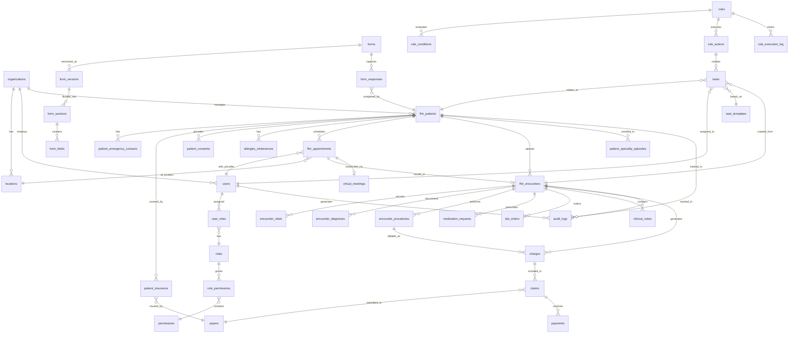
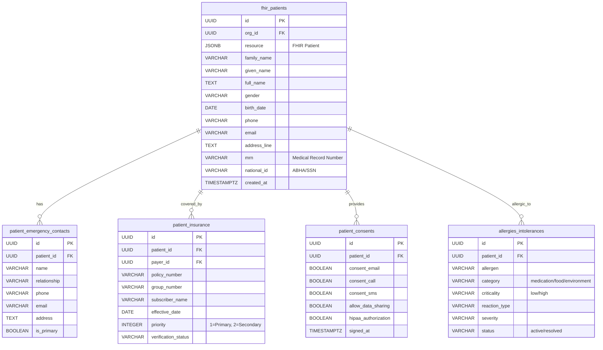
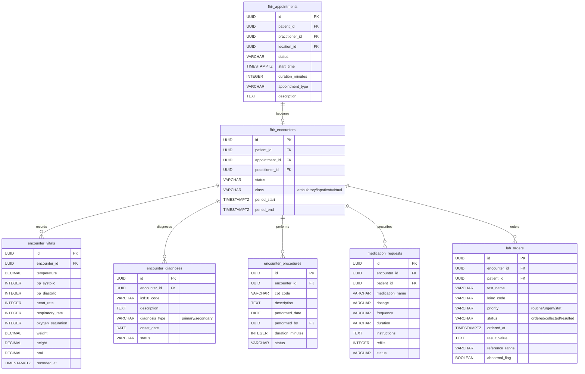
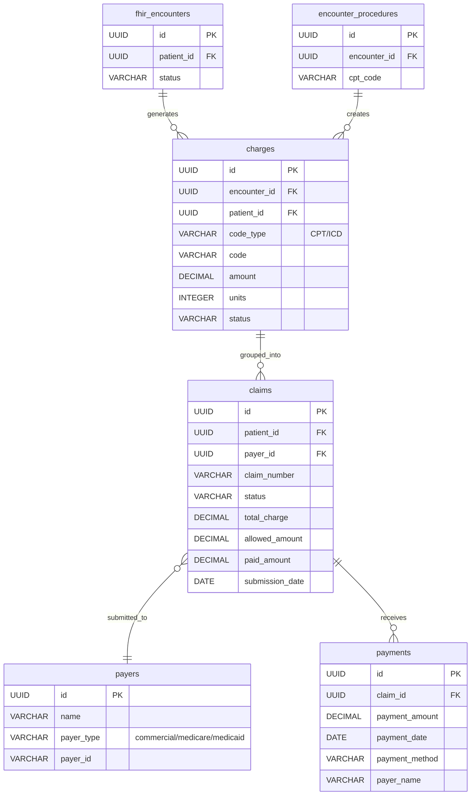

# EHRConnect Visual ER Diagram
**Date**: December 17, 2025
**Version**: 1.0.0
**Purpose**: Visual representation of complete database structure

## Complete Entity Relationship Diagram

### Core Patient & Clinical Workflow

### Detailed Patient Management

### Clinical Encounter Workflow

### Billing & Revenue Cycle

## Table Count Summary

### By Domain

| Domain | Table Count | Status |
|--------|-------------|--------|
| Organization & Access | 7 | ✅ Complete |
| Patient Management | 9 | ✅ Complete (8 new tables added) |
| Clinical Staff | 3 | ✅ Complete |
| Scheduling | 4 | ✅ Complete |
| Clinical Encounters | 9 | ✅ Complete (5 new tables added) |
| Billing & RCM | 7 | ✅ Complete |
| Forms & Questionnaires | 6 | ✅ Complete |
| Rules Engine | 5 | ✅ Complete |
| Tasks | 4 | ✅ Complete |
| Inventory | 6 | ✅ Complete |
| Specialty System | 4 | ✅ Complete |
| Country Compliance | 5 | ✅ Complete |
| Integrations | 5 | ✅ Complete |
| Audit & Security | 5 | ✅ Complete |
| **TOTAL** | **79 tables** | **✅ Complete** |

### New Tables Added (Migration 251217000001)

1. ✅ `patient_emergency_contacts` - Emergency contact information
2. ✅ `patient_insurance` - Insurance coverage details
3. ✅ `patient_consents` - Consent tracking (HIPAA compliance)
4. ✅ `encounter_vitals` - Vital signs measurement
5. ✅ `encounter_diagnoses` - Diagnosis documentation
6. ✅ `encounter_procedures` - Procedure tracking
7. ✅ `lab_orders` - Laboratory test orders and results
8. ✅ `allergies_intolerances` - Allergy and intolerance tracking

## Key Relationships

### Multi-Tenancy Pattern
- All tables have `org_id` foreign key to `organizations`
- Row-level data isolation enforced
- Indexes optimized for org_id queries

### Patient-Centric Design
- `fhir_patients` is the central entity
- All clinical data references patient_id
- FHIR R4 compliant resource storage

### Encounter-Based Workflow
- Appointments → Encounters → Clinical Documentation
- Encounters generate billing charges
- All clinical notes linked to encounters

### Billing Integration
- Encounters → Charges → Claims → Payments
- CPT/ICD codes from clinical tables flow to billing
- Payer relationships tracked

### Audit Trail
- All clinical tables have audit triggers
- Changed tracked in `audit_logs`
- FHIR `AuditEvent` resources created

## Database Statistics

- **Total Tables**: 79
- **Total Indexes**: 300+ (estimated)
- **Foreign Keys**: 150+ relationships
- **Triggers**: 50+ (updated_at, audit, validation)
- **Check Constraints**: 40+ (data validation)
- **FHIR Resources**: 10+ resource types

## Performance Considerations

### Indexing Strategy
- All foreign keys indexed
- Composite indexes for common queries
- GIN indexes for JSONB fields
- Full-text search on patient names

### Query Optimization
- Patient search: `idx_fhir_patients_full_name` (GIN)
- Appointment lookup: `idx_fhir_appointments_start_time`
- Encounter history: `idx_fhir_encounters_patient`
- Active allergies: `idx_allergies_active_meds`

### Partitioning (Future)
- Large tables (encounters, lab_orders) can be partitioned by date
- Archive old data to separate partitions
- Maintain performance with growing data

## Compliance & Security

### HIPAA Compliance
- Patient consents tracked in `patient_consents`
- All PHI access logged in `audit_logs`
- Encryption at rest (PostgreSQL level)
- Row-level security available

### FHIR R4 Compliance
- FHIR resources stored as JSONB
- Extracted fields for performance
- Resource validation on insert/update
- Standard terminologies (ICD-10, CPT, LOINC)

### Data Integrity
- Foreign key constraints enforce relationships
- Check constraints validate data
- Unique constraints prevent duplicates
- Triggers maintain data consistency

## Next Steps

1. **Run Migration**: Execute `251217000001-add-missing-patient-clinical-tables.js`
2. **Update APIs**: Modify services to use new tables
3. **Test Thoroughly**: Validate all CRUD operations
4. **Update Documentation**: API endpoint documentation
5. **Monitor Performance**: Check query performance with new structure

---

**Migration File**: `ehr-api/src/database/migrations/251217000001-add-missing-patient-clinical-tables.js`
**Documentation**: `docs/database-er-diagram-251217.md`
**Last Updated**: December 17, 2025
