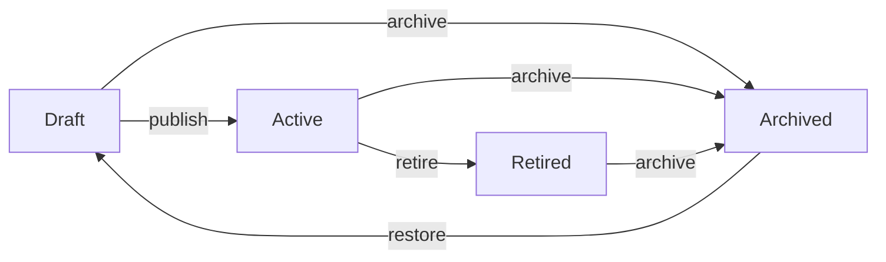

# Form Template Versioning and Lifecycle Management Guide

## Overview

This guide explains how to manage form templates through their lifecycle, including versioning, status transitions, and workflows.

## Form Template Statuses

Forms can be in one of four statuses:

### 1. **Draft** (Initial State)
- **Description**: Form is being created or edited
- **Can Edit**: ✅ Yes, freely editable
- **Can Delete**: ✅ Yes
- **Can Publish**: ✅ Yes (transitions to Active)
- **Can Use**: ❌ No, not available for patient use
- **Versioning**: Not versioned

### 2. **Active** (Published)
- **Description**: Form is live and available for use
- **Can Edit**: ❌ No, must create new version
- **Can Delete**: ❌ No, can only retire
- **Can Publish**: N/A (already published)
- **Can Use**: ✅ Yes, available for patient responses
- **Versioning**: Fully versioned, immutable

### 3. **Retired**
- **Description**: Form is no longer active but preserved for historical data
- **Can Edit**: ❌ No
- **Can Delete**: ❌ No, permanently retired
- **Can Publish**: ❌ No
- **Can Use**: ❌ No, but existing responses are preserved
- **Versioning**: Maintained for audit trail

### 4. **Archived**
- **Description**: Form is hidden from normal views but not deleted
- **Can Edit**: ❌ No
- **Can Delete**: ✅ Yes (soft delete)
- **Can Publish**: ❌ No
- **Can Use**: ❌ No
- **Versioning**: Maintained but hidden

---

## Version Management

### Version Numbering (Semantic Versioning)

Forms use semantic versioning: `MAJOR.MINOR.PATCH`

- **MAJOR**: Breaking changes (e.g., removing required fields, changing data types)
- **MINOR**: New features (e.g., adding new optional questions)
- **PATCH**: Bug fixes, typos, help text updates

Examples:
- `1.0.0` - Initial published version
- `1.1.0` - Added optional questions
- `2.0.0` - Changed required fields structure

### Version Relationships

```
form_templates table:
- id: unique identifier for this version
- parent_version_id: links to the previous version (NULL for v1.0.0)
- version: version string (e.g., "2.0.0")
- is_latest_version: boolean flag (only one version is latest)
```

Example version chain:
```
v1.0.0 (id: abc-123, parent_version_id: NULL, is_latest_version: false)
  ↓
v1.1.0 (id: def-456, parent_version_id: abc-123, is_latest_version: false)
  ↓
v2.0.0 (id: ghi-789, parent_version_id: def-456, is_latest_version: true)
```

---

## API Workflows

### Workflow 1: Create and Publish New Form

```bash
# Step 1: Create draft form
POST /api/forms/templates
{
  "title": "Patient Intake Form",
  "description": "Initial patient information",
  "category": "registration",
  "questionnaire": { /* FHIR Questionnaire */ }
}

# Response: status = "draft", version = "1.0.0"

# Step 2: Test and refine (can edit freely)
PUT /api/forms/templates/{id}
{
  "title": "Updated title",
  "questionnaire": { /* Updated */ }
}

# Step 3: Publish when ready
POST /api/forms/templates/{id}/publish
{
  "version": "1.0.0"  # Optional, auto-increments if not provided
}

# Response: status = "active", version = "1.0.0"
# Form is now immutable and available for use
```

### Workflow 2: Create New Version of Published Form

```bash
# Step 1: Create new version from existing form
POST /api/forms/templates/{id}/versions
{
  "versionType": "minor",  # or "major", "patch"
  "changeNotes": "Added new optional fields for insurance"
}

# Response: New draft with:
# - New ID
# - status = "draft"
# - parent_version_id = {original-id}
# - version = "1.1.0" (auto-incremented)
# - is_latest_version = false

# Step 2: Edit the new draft version
PUT /api/forms/templates/{new-id}
{
  "questionnaire": { /* Updated questions */ }
}

# Step 3: Publish new version
POST /api/forms/templates/{new-id}/publish

# Result:
# - New version: status = "active", is_latest_version = true
# - Previous version: still active but is_latest_version = false
```

### Workflow 3: Retire Old Version

```bash
# Retire previous version after new version is published
POST /api/forms/templates/{old-id}/retire
{
  "reason": "Replaced by version 2.0.0"
}

# Response: status = "retired"
# Existing responses using this version are preserved
# New responses cannot use this version
```

### Workflow 4: View Version History

```bash
# Get all versions of a form template
GET /api/forms/templates/{id}/versions

# Response:
{
  "versions": [
    {
      "id": "ghi-789",
      "version": "2.0.0",
      "status": "active",
      "is_latest_version": true,
      "created_at": "2025-01-15",
      "change_notes": "Major restructure"
    },
    {
      "id": "def-456",
      "version": "1.1.0",
      "status": "retired",
      "is_latest_version": false,
      "created_at": "2025-01-10",
      "change_notes": "Added optional fields"
    },
    {
      "id": "abc-123",
      "version": "1.0.0",
      "status": "retired",
      "is_latest_version": false,
      "created_at": "2025-01-01",
      "change_notes": "Initial version"
    }
  ]
}
```

### Workflow 5: Duplicate Form (Create Independent Copy)

```bash
# Create a copy that starts a new version chain
POST /api/forms/templates/{id}/duplicate
{
  "title": "Modified Patient Intake Form"
}

# Response: New form with:
# - New ID
# - status = "draft"
# - parent_version_id = NULL (independent)
# - version = "1.0.0"
```

---

## Status Transitions



### Allowed Transitions

| From     | To       | API Endpoint              | Notes                        |
|----------|----------|---------------------------|------------------------------|
| Draft    | Active   | POST /.../:id/publish     | Makes form available         |
| Draft    | Archived | POST /.../:id/archive     | Hides draft                  |
| Active   | Retired  | POST /.../:id/retire      | Stops new usage              |
| Active   | Archived | POST /.../:id/archive     | Emergency hide               |
| Retired  | Archived | POST /.../:id/archive     | Long-term storage            |
| Archived | Draft    | POST /.../:id/restore     | Restore for editing          |

### Blocked Transitions

| From     | To     | Reason                                        | Solution                           |
|----------|--------|-----------------------------------------------|-------------------------------------|
| Active   | Draft  | Would break existing responses                | Create new version instead          |
| Retired  | Active | Historical integrity                          | Create new version and publish      |
| Any      | Delete | Data preservation for audit/compliance        | Use archive instead                 |

---

## Best Practices

### 1. Version Increment Guidelines

**Use PATCH (1.0.0 → 1.0.1):**
- Typo fixes
- Help text improvements
- Display order changes
- Theme/styling updates

**Use MINOR (1.0.0 → 1.1.0):**
- Adding new optional questions
- Adding new answer options to existing questions
- New conditional logic that doesn't affect existing paths

**Use MAJOR (1.0.0 → 2.0.0):**
- Removing questions
- Making optional fields required
- Changing question types
- Removing answer options
- Restructuring the form significantly

### 2. When to Retire vs Archive

**Retire when:**
- Replacing with a new version
- Form is outdated but responses need preservation
- Maintaining audit trail is important

**Archive when:**
- Form was created by mistake
- Form is duplicate
- Emergency need to hide form
- Long-term storage after retirement

### 3. Testing New Versions

Before publishing:
1. Create draft version
2. Test with sample data
3. Validate all conditional logic
4. Check population/extraction rules
5. Review with stakeholders
6. Publish when approved

### 4. Handling Active Responses

When creating new version:
- Existing in-progress responses continue using old version
- Completed responses are permanently linked to their version
- New responses use latest published version
- Each response stores the full questionnaire snapshot

---

## Error Handling

### Common Errors and Solutions

#### Error: "Cannot edit published form template"
```json
{
  "error": "Failed to update form template",
  "message": "Cannot edit published form template. Create a new version instead."
}
```

**Solution:**
```bash
# Create new version instead of editing
POST /api/forms/templates/{id}/versions
{
  "versionType": "minor"
}
```

#### Error: "Cannot delete active form template"
```json
{
  "error": "Failed to delete form template",
  "message": "Cannot delete active form template. Retire or archive instead."
}
```

**Solution:**
```bash
# Option 1: Retire the form
POST /api/forms/templates/{id}/retire

# Option 2: Archive the form
POST /api/forms/templates/{id}/archive
```

#### Error: "Version already published"
```json
{
  "error": "Failed to publish form template",
  "message": "Version 1.0.0 already exists. Increment version number."
}
```

**Solution:**
```bash
# Specify a new version number
POST /api/forms/templates/{id}/publish
{
  "version": "1.1.0"
}
```

---

## Database Queries

### Get Latest Version of Each Form

```sql
SELECT * FROM form_templates
WHERE is_latest_version = true
AND status != 'archived'
ORDER BY updated_at DESC;
```

### Get Version History for a Form

```sql
WITH RECURSIVE version_chain AS (
  -- Start with the specified version
  SELECT * FROM form_templates WHERE id = :template_id
  UNION ALL
  -- Recursively get all child versions
  SELECT ft.* FROM form_templates ft
  INNER JOIN version_chain vc ON ft.parent_version_id = vc.id
)
SELECT * FROM version_chain
ORDER BY created_at ASC;
```

### Get All Active Forms (Latest Versions Only)

```sql
SELECT * FROM form_templates
WHERE status = 'active'
AND is_latest_version = true
ORDER BY title;
```

### Count Responses Per Form Version

```sql
SELECT
  ft.id,
  ft.title,
  ft.version,
  COUNT(fr.id) as response_count
FROM form_templates ft
LEFT JOIN form_responses fr ON fr.form_template_id = ft.id
GROUP BY ft.id, ft.title, ft.version
ORDER BY response_count DESC;
```

---

## Migration Considerations

### Migrating Existing Forms

If you have existing active forms without versioning:

```sql
-- 1. Set all existing active forms as version 1.0.0
UPDATE form_templates
SET version = '1.0.0',
    is_latest_version = true,
    parent_version_id = NULL
WHERE version IS NULL OR version = '';

-- 2. Ensure all draft forms have version
UPDATE form_templates
SET version = '1.0.0'
WHERE status = 'draft'
AND (version IS NULL OR version = '');
```

---

## Complete API Reference

### Form Template Lifecycle Endpoints

| Endpoint | Method | Purpose | Status Required |
|----------|--------|---------|-----------------|
| `/api/forms/templates` | POST | Create new draft | N/A |
| `/api/forms/templates/:id` | PUT | Update draft | draft |
| `/api/forms/templates/:id` | GET | Get form details | any |
| `/api/forms/templates/:id/publish` | POST | Publish form | draft |
| `/api/forms/templates/:id/retire` | POST | Retire form | active |
| `/api/forms/templates/:id/archive` | POST | Archive form | any |
| `/api/forms/templates/:id/restore` | POST | Restore archived | archived |
| `/api/forms/templates/:id/versions` | POST | Create new version | active |
| `/api/forms/templates/:id/versions` | GET | List versions | any |
| `/api/forms/templates/:id/duplicate` | POST | Duplicate form | any |

### Request/Response Examples

See API workflows above for detailed examples.

---

## Summary

**Key Principles:**
1. **Immutability**: Published forms cannot be edited directly
2. **Versioning**: Changes require new versions
3. **Preservation**: All versions preserved for audit trail
4. **Flexibility**: Draft forms can be edited freely
5. **Safety**: Multiple status levels prevent accidental changes

**Common Workflows:**
- Creating new forms: Draft → Edit → Publish
- Updating forms: Create Version → Edit → Publish
- Retiring forms: Active → Retired → Archived
- Testing: Draft → Test → Edit → Publish

For questions or issues, refer to the error handling section or contact the development team.
